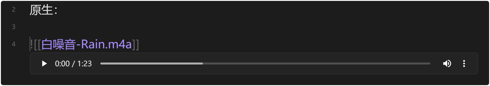
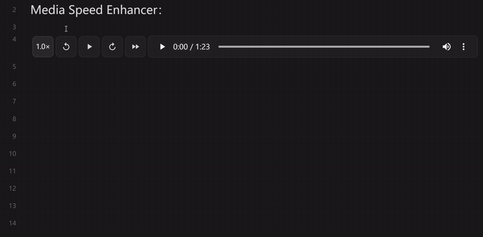
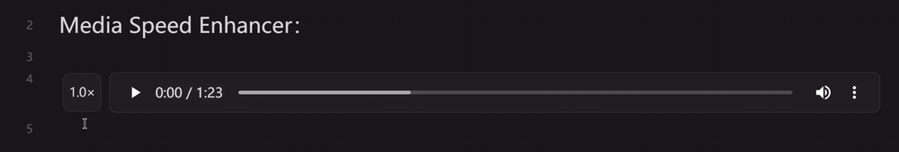
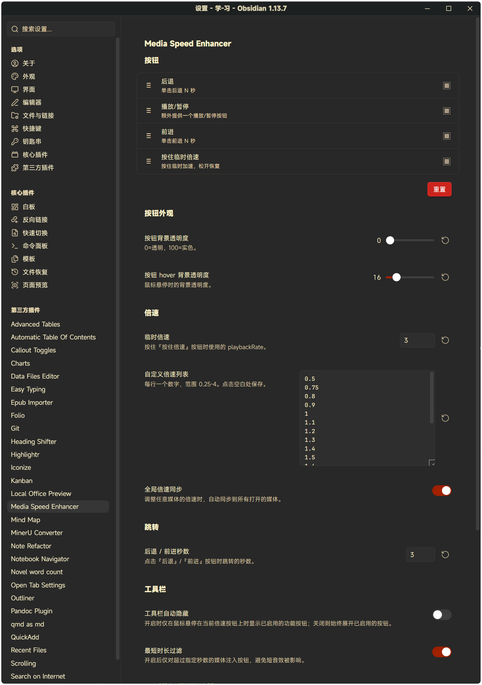

<p align="center">
  
</p>

# Media Speed Enhancer

[](https://github.com/liyifan2004/obsidian-media-speed-enhancer/releases)
[](LICENSE)
[](https://obsidian.md)

[简体中文](README.md) | English

> A minimal enhancement toolbar layered on top of Obsidian's native HTML5 audio/video players:
> **←10s** / **→10s** / **hold-to-speed** / **speed menu**. Minimal intrusion, native UI untouched.

The plugin UI follows Obsidian's interface language automatically (English / 简体中文).

## Features

| Button | Behavior |
| --- | --- |
| `←10s` | Skip back 10 seconds on click |
| `→10s` | Skip forward 10 seconds on click |
| `Hold speed` | Immediately switch to a temporary speed (default 2.0×) while held; restore the previous playbackRate on release |
| `Speed menu` | Left / right click opens a menu to pick a permanent speed; menu items come from `customSpeeds` in settings |

In addition, the left side of the toolbar always shows a compact **current-speed badge** (e.g. `1.5×`); clicking it resets to `1.0×`, and right-click opens the same speed menu.

## Demo

The native player (for comparison):



Enhanced (←10s / →10s / hold-to-speed / current-speed badge):





## Installation (developer mode)

1. Clone this repo into `<vault>/.obsidian/plugins/media-speed-enhancer/`.
2. Enter the directory: `cd .obsidian/plugins/media-speed-enhancer`
3. Install dependencies: `npm install`
4. Build: `npm run build` — this generates `main.js`
5. In Obsidian → Settings → Community plugins, enable **Media Speed Enhancer**.
6. For development, `npm run dev` starts watch mode.

> Compatibility: Obsidian 1.5.0+ (desktop and mobile, `isDesktopOnly: false`).

## Usage

Once enabled, every `<audio>` / `<video>` element embedded in the vault (Markdown embeds, Live Preview, Canvas, etc.) automatically gets the toolbar.

- The toolbar is **auto-hidden** by default: it appears when the mouse enters the media area, and collapses to the left "current-speed badge" when the mouse leaves.
- Turn off **Auto-hide toolbar** in settings to keep it always visible.

## Settings

Open Obsidian → Settings → Media Speed Enhancer:



| Setting | Description | Default |
| --- | --- | --- |
| **Temporary speed** | The playbackRate used while the hold-to-speed button is pressed, 0.25 – 4.0 | `2.0` |
| **Custom speed list** | One number per line, e.g. `1.5\n1.75\n2.0`. Duplicates are removed, invalid values filtered, sorted ascending | `[0.5, 0.75, 1.0, 1.25, 1.5, 1.75, 2.0, 2.5, 3.0]` |
| **Show buttons** | Master switch. When off, no buttons are injected, but the MutationObserver keeps running so new elements are never missed | `true` |
| **Touch optimization** | Use pointer events for touch screens; when off, only mousedown/mouseup are bound | `true` |
| **Auto-hide toolbar** | Expand on hover over the media element; when off, always visible | `true` |

> Since v1.0.2: all buttons sit to the **left** of the native controls (the audio element shrinks by 168px); there is no longer a "button position" option.

## Technical notes

### Why a side toolbar (flex layout) instead of an overlay?

The native HTML5 `<audio controls>` / `<video controls>` bar is rendered by the browser inside a **Shadow DOM**; external JS cannot reach its internals. That is Web-spec behavior, not an Obsidian quirk.

Before v1.0.2 this plugin floated the toolbar **over** the native bar, which often covered the text above. Since the v1.0.2 rework, all controls (the anchor speed badge + 4 toolbar buttons) sit as **flex items to the left of** the `audio`/`video` element, vertically centered; the media element itself shrinks to `calc(100% - 168px)` to make room. As a result:

- The native player is never modified or replaced
- Nothing above the native bar gets covered
- Automatically adapts to any Obsidian theme (CSS variables)
- No third-party player library involved

### MutationObserver + polling fallback

The plugin watches `document.body` and `app.workspace.containerEl` (subtree/childList) and injects the toolbar into every new `<audio>` / `<video>`, recursively scanning **inside** added nodes (so a wholesale parent replacement never hides media). Injected elements are tracked in a `WeakMap`, which survives re-renders and supports re-mounting.
Skipped targets: media inside iframes (YouTube and other third-party embeds) and elements outside the Obsidian content area.

For 30 seconds after startup, a full scan (`scanAllMedia`) runs every 2 seconds as a fallback for dynamic insertions the observer might miss.

## Known limitations

1. **The native Shadow DOM control bar cannot be injected into** — all enhancements live in a separate toolbar, visually detached from the native bar.
2. **Native audio controls are often not shown by default** (Chrome only shows audio controls in certain cases); this plugin's toolbar is always visible, so playback stays fully controllable either way.
3. **Command palette commands** — 4 commands are registered (skip back, skip forward, toggle temporary speed, play/pause). They ship without default hotkeys by design; bind your own in Settings → Hotkeys.
4. **No injection into third-party embeds** (YouTube iframes etc.) — cross-origin restrictions, by design.

## Development

```bash
npm install
npm run build      # bundle to main.js (production)
npm run dev        # watch mode, auto rebuild
```

Build artifacts:

- `main.js` — bundled plugin entry
- `styles.css` — loaded by Obsidian automatically, no extra config
- `manifest.json` — plugin metadata

## License

[MIT](LICENSE)
